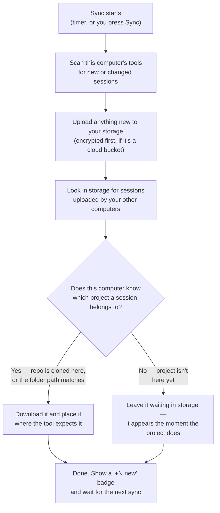

# VibeSync

**Keep your AI coding sessions on every computer you use.**

Start a Claude Code session on your desktop, open your laptop, and carry on where you left off — the conversation, plans, memory, custom agents, skills and settings all came with you. Works on **macOS and Windows**, in any mix.

Your data goes to a place **you** own: a folder you already sync (iCloud Drive, OneDrive, Dropbox, Google Drive), your own cloud bucket (Cloudflare R2, Amazon S3, Azure), or a USB disk. No account, no middleman server, and anything bound for the cloud is encrypted on your machine first.

<p align="left"><b><a href="https://github.com/keskolab/vibesync/releases">⬇ Download VibeSync for macOS and Windows</a></b></p>

<p align="center">
  
  
  
  
</p>

**Why this exists:** AI coding tools keep sessions on the machine where they happened. Vendors don't sync them, and some delete transcripts after ~30 days. Your conversations, plans and project memory are worth keeping — and worth having on whichever computer you sit down at.

**Contents** — [Quick start](#quick-start) · [What syncs](#what-syncs) · [Where your data lives](#where-your-data-lives) · [The passphrase](#the-passphrase) · [How syncing works](#how-syncing-works) · [How projects are matched](#how-projects-are-matched) · [FAQ](#faq) · [Troubleshooting](#troubleshooting) · [Every file VibeSync touches](#every-file-vibesync-touches)

---

## Quick start

### 1. Install

Download the installer from the [Releases page](https://github.com/keskolab/vibesync/releases): a `.dmg` for macOS (Apple Silicon and Intel), a `.exe` or `.msi` for Windows. It updates itself from then on.

<details>
<summary>Windows shows an "unknown publisher" warning — here's why</summary>

The app isn't code-signed: a publisher certificate costs several hundred dollars *per year*, hard to justify for a free, open-source tool. The warning means "Windows doesn't know who built this", not "this is dangerous" — all the code is in this repository, and building it yourself produces the identical app.

Click **More info → Run anyway**. If Microsoft Edge also blocks the *download*, the Keep option hides behind **⋯ next to Delete → Keep → Show more → Keep anyway**. The macOS build is signed with an Apple developer certificate and opens normally.
</details>

<details>
<summary>Or build from source</summary>

You need [Rust](https://rustup.rs) and [Node.js](https://nodejs.org):

```sh
git clone https://github.com/keskolab/vibesync
cd vibesync/app && npm install && npm run tauri dev
```

Optional check: `cargo test --workspace`
</details>

### 2. Set up your first computer

VibeSync lives in the **menu bar** (macOS) or **system tray** (Windows). Open it and the Setup Assistant asks three things:

1. **Which tools to sync** — it detects what you have installed.
2. **Where your data should live** — see [storage options](#where-your-data-lives).
3. **A passphrase**, if you chose cloud storage — see [the passphrase](#the-passphrase).

Then press **Sync**.

### 3. Add your second computer

Install VibeSync there, point it at **the same storage**, and enter **the exact same passphrase**. Press Sync.

> **The one thing that must match: the passphrase.** It is the key your files are encrypted with, so a computer with a different one cannot read anything the others uploaded. Setup now checks this for you and says *"✓ Correct — this passphrase opens the data already in this storage"* before you continue.

One habit worth forming: **sync first, open your AI apps after.** They read their history when they start, so an app that was already open won't show what just arrived until you restart it.

---

## What syncs

| Tool | What follows you |
|---|---|
| **Claude Code** | Sessions, subagents, memory, plans, tasks, history, agents, skills, rules, settings — and synced sessions appear in the Claude desktop sidebar. Extra accounts (`~/.claude-work`) sync separately. Plugins only if you opt in |
| **VS Code Copilot Chat** | Chat history per project, visible in the Chat panel on every machine |
| **Codex** | Session transcripts and the thread database — every machine lists all sessions |
| **OpenCode** | Sessions, merged at the database level |
| **Copilot CLI** | Standalone `copilot` sessions, conversations included — resume them anywhere |
| **Zed** | Agent threads (best synced while Zed is closed) |
| **All tools** | Global skills in `~/.agents/skills` ([Agent Skills spec](https://agentskills.io)) |

Every tool has its own on/off switch and finer-grained scopes. Each tool's page shows a **"+N new"** badge when a sync brings something in, and how many items are **waiting in storage** for a project that isn't on this computer yet.

---

## How projects are matched

When a session moves between computers, VibeSync has to answer one question: **which project does this belong to here?** There are three answers, and two of them need nothing from you.

**1. It's a git repository** → matched by the repository address (`github.com/you/todo-app`). Clone it **anywhere** — the location never matters.

**2. It's a plain folder** → matched by its place *inside your home folder*. `~/Documents/notes` on a Mac is the same project as `C:\Users\you\Documents\notes` on Windows.

**3. It's a plain folder in a different place on each computer** → the only case that needs you. Give it a **project name** (Settings → Project mappings): the same name on every computer, each pointing at that computer's copy.

| Computer | Folder there | Project name you type |
|---|---|---|
| Windows PC | `D:\misc\stuff` | `stuff` |
| MacBook | `/Volumes/Data/stuff` | `stuff` |

A mapping covers everything beneath the folder, so naming a parent like `D:\Code` once takes care of every project inside it.

### Example: a Mac and a Windows PC

| Project | On the Mac | On the Windows PC | Do sessions follow you? |
|---|---|---|---|
| Git repo `todo-app` | `~/dev/todo-app` | `C:\Github\todo-app` | ✅ Yes — the repo is the ID |
| Plain folder `notes` | `~/Documents/notes` | `C:\Users\you\Documents\notes` | ✅ Yes — same spot inside home |
| Plain folder `stuff` | `~/Desktop/stuff` | `D:\misc\stuff` | ⚠️ Give it a project name |
| Repo not cloned yet | `~/dev/todo-app` | *(not cloned)* | ⏸ Waits in storage until you clone it |

### Example: everything in one Dropbox folder

```
~/Dropbox/Projects/
├── website/     ← git repo
├── recipes/     ← plain folder, no git
└── scraper/     ← plain folder, no git
```

Nothing to configure. `website` matches by its repository address; the plain folders match because Dropbox sits at the same place inside your home folder on every machine. This is the simplest answer for projects that never got a git repo: keep them in one folder that exists on all your computers.

Worth spelling out: Dropbox syncs those folders' *files*, but your AI sessions never live inside the project folder — each tool keeps them in its own data folder (`~/.claude`, `~/.codex`, VS Code's storage). **Dropbox moves your code; VibeSync moves the conversations about it.**

---

## Where your data lives

You pick one place. All of your computers point at that same place.

| Option | Good for | Encrypted? |
|---|---|---|
| **A folder** — iCloud Drive, OneDrive, Dropbox, Google Drive | The simplest choice: you already have it, and it syncs itself | Compressed, not encrypted (it's your own folder) |
| **Cloudflare R2** | Your own bucket; generous free tier | ✅ Always, before upload |
| **Amazon S3** | Your own bucket | ✅ Always, before upload |
| **Azure Blob** | Paste one container SAS URL — no account keys | ✅ Always, before upload |
| **A USB disk or plain local folder** | Air-gapped, manual, no cloud at all | Compressed, not encrypted |

Changing your mind later is fine: **Settings → Change storage**.

---

## The passphrase

If you chose cloud storage, VibeSync asks for a passphrase. It's worth 30 seconds to understand, because it's the one setting that can silently break syncing.

**What it is.** Not a cloud credential — those (bucket, access key) just prove you may use the bucket. The passphrase is what your files are **encrypted with**. VibeSync turns it into an encryption key and locks every file with it *on your computer*, before upload. Your cloud provider only ever holds files it cannot read.

**Why every computer needs the same one.** The same passphrase always produces the same key — that is the entire mechanism by which your computers can read each other's data. There is no key exchange and no account. A computer given a *different* passphrase produces a *different* key, so it cannot read anything the others wrote, and they cannot read what it writes.

**Where it's kept.** In your system's password vault (macOS Keychain, Windows Credential Manager). It never leaves your computers, and nobody — including us — can recover your data without it. Write it down somewhere safe.

**If you forget it** and still have a working computer, you can read it back: macOS **Keychain Access** → search *VibeSync* → entry `store-secrets`.

---

## How syncing works

Every computer runs the same small app, and they never talk to each other directly. They all talk to one shared place — your storage. Each computer regularly does two things: *upload anything new I have*, and *download anything new the others left for me*. That's the whole idea.



Four rules hold for every sync:

- **Nothing is ever lost.** Sync never deletes. If the same session changed on two computers, the newer version wins and the older one is kept beside it as a `.vibesync-bak` file.
- **Nothing comes back from the dead.** When a tool cleans up old sessions, your storage keeps them — but they're never pushed back onto a computer that already cleaned them up.
- **Only changes transfer.** After the first sync, routine syncs take seconds.
- **A problem with one file costs one file.** An item that can't be read or written is skipped, counted and explained in the log; everything else still syncs, and the skipped item is retried automatically.

Auto-sync runs in the background every 15 minutes by default (adjustable in Settings).

---


---

## FAQ

<details>
<summary><b>Do I need an account? Is there a server in the middle?</b></summary>

No to both. There is no account, no sign-in and no VibeSync server. Your computers never talk to each other directly either — each one reads and writes a storage location that **you** own, and that is the only thing they share.

</details>

<details>
<summary><b>What does it cost?</b></summary>

The app is free and open source (GPL-3.0). The only cost is whatever your storage costs: a folder you already sync (iCloud Drive, OneDrive, Dropbox) costs nothing extra, Cloudflare R2 has a generous free tier, and a USB disk is a one-off.

</details>

<details>
<summary><b>Is my data encrypted?</b></summary>

If you chose a **cloud bucket** (R2, S3, Azure) — always, on your computer, before upload. Your provider only ever holds files it cannot read. See [the passphrase](#the-passphrase).

If you chose a **plain folder or USB disk** — compressed, not encrypted. That storage is already yours, and adding a passphrase there would mean one more thing to lose.

</details>

<details>
<summary><b>Does it sync my code too?</b></summary>

No — and it doesn't need to. Your AI sessions never live inside your project folder; each tool keeps them in its own data folder (`~/.claude`, `~/.codex`, VS Code's storage). Git or Dropbox moves your code; **VibeSync moves the conversations about it.**

</details>

<details>
<summary><b>Does it work between macOS and Windows?</b></summary>

Yes, in any mix — a Mac at home and a Windows PC at work sync with each other. Paths are translated in both directions, so a session started in `C:\Github\app` lands in `~/dev/app` and stays one project. See [how projects are matched](#how-projects-are-matched).

</details>

<details>
<summary><b>How many computers can I use?</b></summary>

As many as you like. Each one installs VibeSync, points at the same storage, and uses the same passphrase.

</details>

<details>
<summary><b>What happens if I edit the same session on two computers?</b></summary>

The newer version wins and the older one is kept next to it as a `.vibesync-bak` file. Sync never deletes anything, so nothing is lost either way.

</details>

<details>
<summary><b>My AI tool deletes old sessions. Does VibeSync delete them too?</b></summary>

The opposite — your storage keeps them after the tool has cleaned them up locally. They are never pushed back onto a computer that already deleted them, so cleaning up stays cleaned up while the archive survives.

</details>

<details>
<summary><b>Can I sync some tools but not others?</b></summary>

Yes. Every tool has its own on/off switch, plus finer scopes within it (sessions, plans, config). Claude Code plugins are opt-in because they can be large.

</details>

<details>
<summary><b>Can I change where my data lives later?</b></summary>

Yes — **Settings → Change storage**. Nothing already synced is lost.

</details>

<details>
<summary><b>Do I have to sync manually?</b></summary>

No. Auto-sync runs every 15 minutes by default and the interval is adjustable in Settings. The **Sync** button is there for when you don't want to wait.

</details>

<details>
<summary><b>Why does Windows say "unknown publisher"?</b></summary>

The Windows build isn't code-signed — a publisher certificate costs several hundred dollars per year, which is hard to justify for a free tool. The warning means "Windows doesn't know who built this", not "this is dangerous". All the code is in this repository and building it yourself produces the identical app. The macOS build is signed and opens normally.

</details>

---

## Troubleshooting

Open the section that matches what you're seeing. If you're not sure, start with the log — it names the problem in plain language.

<details>
<summary><b>Start here — turn on the log</b></summary>

**Settings → Debug logging**, then sync once. The log records exactly what happened, in plain language.

| | Where the log is |
|---|---|
| macOS | `~/Library/Application Support/com.keskolabs.vibesync/debug.log` |
| Windows | `%APPDATA%\com.keskolabs.vibesync\debug.log` |

Settings has a **Show debug.log** button that opens the folder for you. The file is capped at 5 MB, keeping one previous file alongside it.

Every sync ends with a one-line summary:

```
sync done in 12874 ms — 164 up, 0 down
```

If anything was skipped, it says so, and why:

```
sync done in 11799 ms — 12 up, 40 down, 2 skipped (unreadable — check every machine uses the same passphrase)
```

</details>

<details>
<summary><b>Nothing syncs at all — one computer sees nothing</b></summary>

Almost always a **passphrase mismatch**: that computer was set up with a different passphrase, so it cannot read anything the others uploaded.

VibeSync now says this outright. Look for this block in the log:

```
===================== PASSPHRASE PROBLEM =====================
10842 of 10896 objects in your storage could not be read by THIS computer.
They were written by: my-laptop (5349), work-pc (4200), mac-mini (1293)
This computer's passphrase is not the one your other computers use,
so it cannot read anything they uploaded — that is why nothing arrives here.
FIX IT ON THIS COMPUTER: Settings -> Change storage -> enter the same
passphrase your other computer uses. Nothing is lost; everything syncs
as soon as the passphrases match.
==============================================================
```

The same block appears on a **healthy** computer when a *different* machine is the misconfigured one — and it names that machine, so you know where to go:

```
===================== PASSPHRASE PROBLEM =====================
34 object(s) in your storage could not be read here.
Every one of them was written by: mac-mini
That computer is using a different passphrase from this one, so
the work it uploads cannot be read by the rest of your machines.
FIX IT ON mac-mini: Settings -> Change storage -> enter the same
passphrase this computer uses. Nothing is lost; those files stay in your
storage and become readable as soon as the passphrases match.
==============================================================
```

**The fix:** on the computer named in the message, go to **Settings → Change storage** and enter the passphrase your other computers use (recover it from a working machine's Keychain if you've forgotten it — see [the passphrase](#the-passphrase)). The setup screen verifies it against your storage and tells you whether it's right *before* you finish.

Nothing is lost either way. Files that machine uploaded with the wrong passphrase repair themselves — see *I fixed the passphrase* below.

</details>

<details>
<summary><b>I fixed the passphrase — what about the files uploaded with the wrong one?</b></summary>

They repair themselves. You don't need to do anything.

While a computer had the wrong passphrase, whatever it uploaded went into your storage encrypted with a key nobody else has — including, after you correct it, that computer itself. But the original files never left its disk. So when VibeSync finds a file **it uploaded itself** that it can no longer read, it draws the only possible conclusion: the copy in storage is stale, the local file is the good one. It forgets the upload and re-sends it with the current passphrase on the next sync. You'll see it in the log:

```
self-heal: 50 object(s) uploaded by this computer are unreadable here — they were
encrypted with a passphrase it no longer uses. Forgetting them so the next sync
re-uploads the local copies with the current passphrase.
```

Two syncs after correcting the passphrase, everything is readable everywhere and the `PASSPHRASE PROBLEM` block stops appearing on all your computers.

It only ever redoes its **own** uploads. Files another computer wrote are never overwritten from here — that machine has the good local copies, so it must be fixed there.

**The one case it can't fix:** if the local original is genuinely gone (the machine was wiped, or the tool deleted an old session), the unreadable copy in storage is the only one left, and without the old passphrase it stays unreadable. Nothing else is affected — everything readable keeps syncing normally.

</details>

<details>
<summary><b>A few items were skipped, but most synced</b></summary>

Individual lines look like this:

```
cannot decrypt claude/projects/.../session.jsonl — written by a machine using a different passphrase; skipping it
claude-code: 4 object(s) skipped — unreadable in the store; everything else applied
```

That's the same passphrase problem, limited to whatever one machine uploaded. Everything else keeps syncing normally, and skipped items are retried on every sync — they land by themselves once the passphrase is corrected.

</details>

<details>
<summary><b>Synced sessions don't show up in the app</b></summary>

GUI tools (Claude Code, VS Code, Zed) read their session history **once, when they start**, and never look again while running. So:

1. **Let the sync finish before you open the app.**
2. **App already open? Restart it fully** — Cmd+Q on macOS, not just closing the window.

VibeSync tells you when this applies: the badge changes to *"+N new · restart VS Code"*, and clears itself once you've restarted. Command-line tools (Codex, Copilot CLI, `claude`) are never affected — they read fresh every run.

</details>

<details>
<summary><b>Sessions are "waiting in storage"</b></summary>

They belong to a project this computer doesn't have yet. Clone the repo (or create the folder) and they arrive on the next sync. Each tool's page shows the count.

If you *have* cloned the repo and they still wait, VibeSync hasn't found your copy — it looks where your other computers keep their projects, and next to repos it already knows here. Point it at your code with **Settings → Code folders**:

| Computer | What you'd add |
|---|---|
| MacBook | `~/Development` |
| Desktop with a code drive | `/Volumes/Backup/Development` |
| Windows PC | `D:\Code` |

This doesn't change any project's identity — it only tells VibeSync where to look. Most people never need it.

</details>

<details>
<summary><b>A "(fork)" copy of my session appeared</b></summary>

Claude did that, not VibeSync, and nothing is lost.

When you open a session that was started on a *different* computer, Claude doesn't continue it — it makes a copy for you to carry on in, named "…(fork)", and moves the original into the sidebar's **Archived** list on that computer only. Your other computers still show the original as before.

- **Keep working in the fork** — it's the live one.
- **Want the original back in the list?** Unarchive it once; that choice sticks, and syncing never changes it.
- **Don't want the fork?** Archive or delete it — also sticks, on that computer.

</details>

---

## Every file VibeSync touches

<details>
<summary>Full transparency list</summary>

Nothing outside this list is read or written. `~` is your home folder (`C:\Users\<you>` on Windows). Tools that aren't installed or are switched off aren't touched at all.

**Your AI tools' data:**

| Tool | Files | What VibeSync does |
|---|---|---|
| Claude Code | `~/.claude/projects/` (sessions, transcripts, memory) | Syncs |
| Claude Code | `~/.claude/plans/`, `tasks/`, `agents/`, `skills/`, `rules/` | Syncs |
| Claude Code | `~/.claude/history.jsonl`, `settings.json`, `settings.local.json`, `CLAUDE.md` | Syncs |
| Claude Code | `~/.claude/plugins/` | Only if you opt in; caches and per-machine install registries never — marketplaces follow you, installs stay local (`/plugin install` once per machine) |
| Claude Code | `~/.claude-<profile>/` (extra accounts) | Same as above, per profile |
| Claude Code | Desktop app sidebar registry ¹ | Adds/heals entries for synced sessions; natives backed up first |
| VS Code | `.../Code/User/workspaceStorage/<id>/chatSessions/` ² | Syncs Copilot chats per project |
| VS Code | `.../Code/User/workspaceStorage/<id>/state.vscdb` ² | Updates one key (the chat index) so synced chats show in the panel |
| Codex | `~/.codex/sessions/`, `~/.codex/session_index.jsonl` | Syncs; merges the index so every machine lists all sessions |
| Codex | `~/.codex/state_<N>.sqlite` | Merges synced threads in (insert/update-newer only, never deletes); one-time backup before the first write |
| OpenCode | `~/.local/share/opencode/opencode.db` | Merges synced sessions in (insert/update-newer only, never deletes); one-time backup before the first write |
| OpenCode | `~/.local/share/opencode/project/`, `storage/` | Syncs each project's records (current and legacy layouts) |
| Zed | `.../Zed/threads/threads.db` ³ | Syncs thread rows, newest wins |
| Copilot CLI | `~/.copilot/session-state/` | Syncs |
| Copilot CLI | `~/.copilot/session-store.db` | Merges synced conversations in (insert/update-newer only, never deletes); one-time backup before the first write |
| Copilot CLI | `~/.copilot/config.json`, `settings.json`, `logs/` | Never touched — auth/trust stays local |
| All tools | `~/.agents/skills/` | Syncs global skills |
| All tools | `meta/git_atlas.json` (in your storage) | Fleet map of where each machine keeps each project (paths only) |

¹ macOS: `~/Library/Application Support/Claude/claude-code-sessions/`; Windows Store app: inside the Claude package under `%LOCALAPPDATA%\Packages\`.
² macOS: `~/Library/Application Support/Code/User/workspaceStorage/`; Windows: `%APPDATA%\Code\User\workspaceStorage\`.
³ macOS: `~/Library/Application Support/Zed/`; Windows: `%APPDATA%\Zed\` or `%LOCALAPPDATA%\Zed\`.

**VibeSync's own files** (macOS: `~/Library/Application Support/com.keskolabs.vibesync/`, Windows: `%APPDATA%\com.keskolabs.vibesync\`):

| File | What it holds |
|---|---|
| `config.json` | Settings and storage location. Credentials and passphrase live in the OS keychain — this file holds a `@keychain` marker instead. Never uploaded |
| `state.json` | Fingerprints of already-synced files, so only changes transfer |
| `git_roots.json` | Which local folder each git project lives in on this machine |
| `new_items.json` | The "+N new" counts shown on each app's card |
| `applied_registry.json`, `registry-backup/` | Sidebar entries VibeSync added, and backups of the originals |
| `store_list_cache.json` | Cloud listing cache so routine syncs make a handful of requests instead of thousands |
| `debug.log` | Only when the Settings toggle is on. Capped at 5 MB, keeping one previous file (`debug.log.old`) |
| `hash_cache.json`, `ghost_cache.json` | Speed caches: file fingerprints across launches; known-stale sidebar entries |

**Inside your storage** (all under `v1/files/`, each file with a small `.meta` sidecar; encrypted before upload on cloud backends): `claude/`, `vscode/ws/`, `codex/`, `opencode/`, `zed/threads/`, `copilot/session-state/`, `shared/skills/`.

</details>

---

## License

VibeSync is **GPL-3.0** — free to use, modify and share; derivative distributions must remain open under the GPL.

This project is **open source, but not open contribution**: pull requests are not accepted, so the codebase stays single-author (which keeps dual-licensing possible). Bug reports, feature requests, and *adapter intel* (where tool X stores its sessions on platform Y) are very welcome as issues.

**Commercial licensing** (closed-source embedding or distribution) is available — contact the author.

Copyright © 2026 JohnKesko
