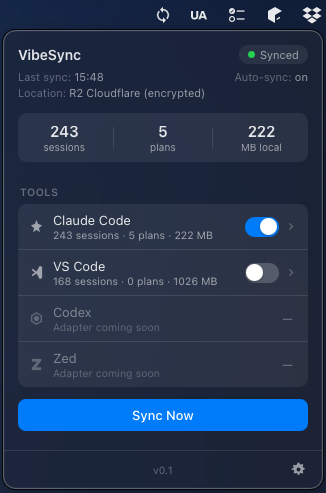
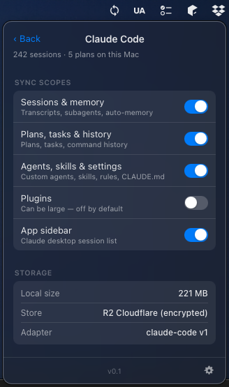
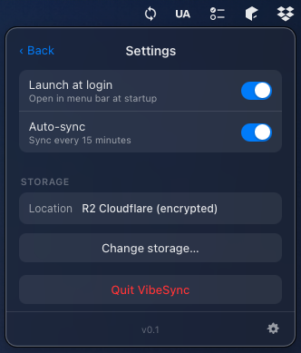
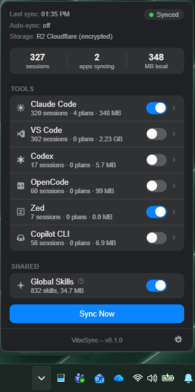
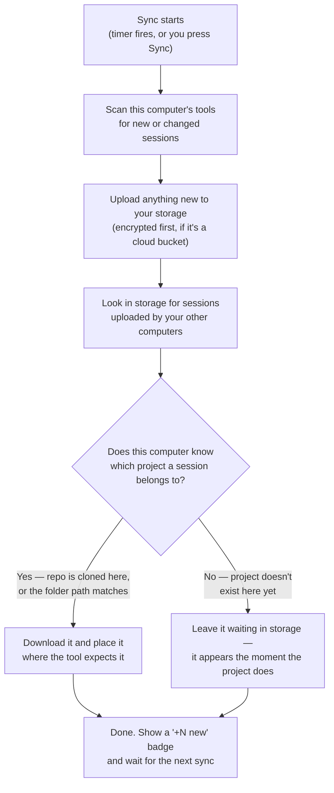

# VibeSync

VibeSync is a small menu bar app that keeps your AI coding sessions in sync across all your computers. Start a Claude Code session on your desktop, open your laptop, and continue where you left off — history, plans, custom agents, skills, and settings included.

It runs on **both macOS and Windows**, in any mix — a Mac at home and a Windows PC at work sync with each other just fine, and sessions translate across the two systems automatically.

<p align="center"><b><a href="https://github.com/JohnKesko/vibesync/releases">⬇️&nbsp;&nbsp;Download VibeSync — installers for macOS and Windows</a></b><br/><sub>(details and a note about the Windows install warning in <a href="#how-to-install-vibesync">How to install</a>)</sub></p>

Your data lives in a place **you** control: a folder you already sync (iCloud Drive, OneDrive, Dropbox, Google Drive), your own cloud bucket (Cloudflare R2, Amazon S3, Azure), or a USB disk. There is no account, no middleman server — and anything sent to cloud storage is encrypted on your machine first.

<p align="center">
  
  
  
  
</p>

### Why does this exist?

AI coding tools keep sessions on the machine where they happened. Vendors don't sync them, and some tools even delete transcripts after ~30 days. Your conversations, plans, and project memory are valuable — they shouldn't be stuck on one computer or quietly disappear.

### How it works

In plain english: every computer runs the same small app, and they never talk to each other directly. They all talk to one shared place — your storage. Each computer regularly does two things: *"upload anything new I have"* and *"download anything new the others left for me."* That's the whole idea.

1. Start with any computer, for example computer A.
2. Computer A looks through your sessions and sends anything new to the storage you chose.
3. Computer B (and C, and D…) does the same — and downloads anything it doesn't have yet.
4. Auto-sync repeats this in the background (every 15 minutes by default, adjustable in Settings).

One sync, step by step:



The rules every sync follows:

- **Nothing is ever lost.** Sync never deletes anything. If the same session changed on two computers, the newer version wins and the older one is kept beside it as a backup file.
- **Nothing comes back from the dead.** When a tool cleans up old sessions (Claude does after ~30 days), your storage keeps them forever — but they're never pushed back onto a computer that already cleaned them up.
- **Works across your computers with zero setup.** A session from `C:\Github\app` on your PC lands in `~/dev/app` on your Mac — same project, different folders, nothing to configure. Git projects are recognized by the repository itself; everything else follows your home folder layout automatically. If a computer doesn't have a project yet, that project's sessions just wait in your storage until it shows up — clone the repo and they're there.
- **Only changes transfer.** After the first sync, routine syncs finish in seconds.
- Adding another computer is just: install VibeSync, point it at the same place, enter the same passphrase, press Sync. One habit worth forming: **sync first, open your AI apps after** — they read their history when they start (details in ["Synced sessions don't show up?"](#synced-sessions-dont-show-up)).

### Git repo or just a folder? Why it matters

When VibeSync moves a session from one computer to another, it has to answer one question: **"which project does this session belong to on the new computer?"** How it answers depends on whether your project folder is a git repository or just an ordinary folder.

- **A git repository** (cloned from GitHub, GitLab, etc.) carries its own ID card: the repository's address, like `github.com/you/todo-app`. VibeSync uses that address as the project's identity, so it **doesn't matter where the folder lives** on each computer. Clone it anywhere — sessions find it.
- **An ordinary folder** has no ID card. VibeSync falls back to the folder's location *inside your home folder*. `~/Documents/notes` on one Mac matches `~/Documents/notes` on another Mac and `C:\Users\you\Documents\notes` on Windows — same spot relative to home, so sessions still follow you.
- **An ordinary folder at a random location** (an external drive, or a different spot on every machine) matches nothing automatically. This is the one case you fix by hand, with a **project name** — explained next.

#### What's a "project name"?

A project name is a label you give a folder, under **Project mappings** in VibeSync's settings. It's you writing the ID card that the folder doesn't have: on each computer, add a mapping with the **same name**, pointing at **that computer's** copy of the folder.

| Computer | Folder on that computer | Project name you type |
|---|---|---|
| Windows PC | `D:\misc\stuff` | `stuff` |
| MacBook | `/Volumes/Data/stuff` | `stuff` |

That's the entire feature. The name itself can be anything — it just has to be the same everywhere. From then on, VibeSync treats those folders as one project, exactly as if they were clones of the same git repo, and sessions started in one appear in the other.

Two things worth knowing: a mapping covers **everything beneath the folder**, so naming a parent like `D:\Code` once takes care of every project inside it. And most people never need any of this — git projects and home-folder projects already match on their own.

A concrete example — a Mac and a Windows PC:

| Project | On the Mac | On the Windows PC | Do sessions follow you? |
|---|---|---|---|
| Git repo `todo-app` | `~/dev/todo-app` | `C:\Github\todo-app` | ✅ Zero setup — the repo is the ID |
| Plain folder `notes` | `~/Documents/notes` | `C:\Users\you\Documents\notes` | ✅ Same spot inside home |
| Plain folder `stuff` | `~/Desktop/stuff` | `D:\misc\stuff` | ⚠️ Needs a project name (see above) |
| Repo not cloned yet | `~/dev/todo-app` | *(not cloned)* | ⏸ Waits in storage until you clone |

(The verdicts are short on purpose — the bullets above explain each case. And a third or fourth computer behaves exactly like the second: clone the repo, or keep the folder at the same home spot, and sessions follow.)

**A realistic mixed case — everything in one Dropbox folder.** Say every computer runs Dropbox, and `~/Dropbox/Projects` is where all your work lives — a few git repos, and plenty of folders that never got one:

```
~/Dropbox/Projects/
├── website/     ← git repo
├── recipes/     ← plain folder, no git
└── scraper/     ← plain folder, no git
```

Nothing to configure: `website` matches by its repository address, and the plain folders match because Dropbox sits at the same spot inside the home folder on every machine (`~/Dropbox` on a Mac *is* `C:\Users\you\Dropbox` on a PC — same place relative to home). This is the simplest answer for projects that never got a git repo: keep them together in one folder that exists on all your computers, and they all follow you.

And if one computer keeps Dropbox somewhere unusual, like `D:\Dropbox`? Still just **one** mapping, not one per project: give the `Projects` folder itself a project name (the same name on each computer), and everything inside it is covered — including folders you create next month. A mapping applies to the whole tree beneath it.

Worth spelling out: Dropbox already syncs those folders' *files*, but your AI sessions never live inside the project folder — each tool keeps them in its own data folder (`~/.claude`, `~/.codex`, VS Code's storage, …), which Dropbox doesn't cover. Dropbox moves your code; VibeSync moves the conversations about it.

Rule of thumb: **if your project is a git repo, put it wherever you like. If it's just a folder, keep it at the same place inside your home folder on every computer — or give it a project name in VibeSync.**

### The passphrase (cloud storage)

- Data in a cloud bucket is locked (encrypted) on your computer **before** it is uploaded. The cloud provider only ever holds files it cannot read.
- Every computer uses the same passphrase — that's how each one can unlock what the others uploaded.
- It's stored in your system's password vault (macOS Keychain / Windows Credential Manager), never leaves your computers, and nobody can recover your data without it — so write it down.

### What syncs

| Tool | What follows you |
|---|---|
| Claude Code | Sessions, subagents, memory, plans, tasks, history, agents, skills, rules, settings — and synced sessions appear in the Claude desktop sidebar. Extra accounts (`~/.claude-work`) sync separately. Plugins only if you opt in |
| VS Code Copilot Chat | Chat history per project, visible in the Chat panel on every machine |
| Codex | Session transcripts and the thread database (modern builds) — every machine's session list shows all of them; backup taken before the first database write |
| OpenCode | Sessions sync at the database level, with a backup taken before the first write |
| Zed | Agent threads (best synced while Zed is closed) |
| Copilot CLI | Standalone `copilot` sessions, conversations included — resume them from any machine |
| All tools | Global skills in `~/.agents/skills` ([Agent Skills spec](https://agentskills.io)) |

Works on macOS and Windows, in any mix. Each app has its own on/off switch, per-area scopes, a "+N new" badge when a sync brings something in, and the main window shows when the next auto-sync will run. Each app's page also shows how many items are **waiting in storage** for a project that isn't on this computer yet — clone the repo and they land on the next sync.

### Synced sessions don't show up?

Here's the one thing worth knowing about how your AI apps behave: GUI tools (Claude Code, VS Code, Zed) read their session history **once, when they start** — they never check the disk again while running. Two practical rules follow:

1. **Let the sync finish before you open the app.** Sitting down at a computer? Press Sync (or wait for the auto-sync — the main window shows when the next one runs), let it complete, *then* open Claude Code or VS Code. An app opened mid-sync shows whatever was on disk at that half-way moment.
2. **App was already open while the sync ran? Restart it.** Anything delivered while it was running is on disk but invisible. Quit it fully — Cmd+Q on macOS, not just closing the window — and reopen.

VibeSync tells you when rule 2 applies: the badge changes to *"+N new · restart VS Code"* whenever items arrived while that app was running, and the hint disappears on its own once you've restarted it. Command-line tools (Codex, Copilot CLI, `claude`) are never affected — they read fresh on every run. And your data is never at risk either way — this is purely about what's on screen.

### How to install VibeSync

Grab the installer for your system from the [**Releases page**](https://github.com/JohnKesko/vibesync/releases) — a `.dmg` for macOS (works on both Apple Silicon and Intel), a `.exe` or `.msi` installer for Windows. The app updates itself after that.

**A note on the Windows install warning, in the spirit of transparency:** when you run the Windows installer, Windows will warn you about an "unknown publisher" and ask for administrator permission. That's because the app isn't code-signed yet — a publisher certificate costs several hundred dollars *per year*, which is hard to justify for a free, open-source tool. The warning means "Windows doesn't know who built this," not "this is dangerous" — and since every line of the code is public in this repository, you can see exactly what you're running (or build it yourself from source below, which produces the identical app). Click **More info → Run anyway** to proceed. If **Microsoft Edge** additionally blocks the download itself ("Make sure you trust… before you open it"), the Keep option is hidden behind the **⋯ menu next to Delete → Keep → Show more → Keep anyway**. The macOS build is signed with an Apple developer certificate and opens like any other app.

<details>
<summary><b>Or build and run from source</b></summary>

You need two free tools installed first: [Rust](https://rustup.rs) and [Node.js](https://nodejs.org). Then:

```sh
# 1. Get the code
git clone https://github.com/JohnKesko/vibesync
cd vibesync

# 2. Start the app
cd app && npm install && npm run tauri dev
```

Optional health check — run the engine's test suite:

```sh
cargo test -p vibesync-engine
```

</details>

Once it's running, VibeSync appears in your **menu bar** (macOS) or **system tray** (Windows). Open it, walk through the Setup Assistant — pick which tools to sync and where your sessions should live — and press **Sync**.

To sync between computers, repeat the same steps on each one and point them all at the same storage location (with the same passphrase, if it's a cloud bucket).

<details>
<summary><b>Every file VibeSync touches</b> — full transparency list</summary>

Nothing outside this list is read or written. `~` is your home folder (`C:\Users\<you>` on Windows). Tools that aren't installed or are switched off aren't touched at all.

**Your AI tools' data:**

| Tool | Files | What VibeSync does |
|---|---|---|
| Claude Code | `~/.claude/projects/` (sessions, transcripts, memory) | Syncs |
| Claude Code | `~/.claude/plans/`, `tasks/`, `agents/`, `skills/`, `rules/` | Syncs |
| Claude Code | `~/.claude/history.jsonl`, `settings.json`, `settings.local.json`, `CLAUDE.md` | Syncs |
| Claude Code | `~/.claude/plugins/` | Only if you opt in; caches and per-machine install registries never — marketplaces follow you, installs stay local (`/plugin install` once per machine) |
| Claude Code | `~/.claude-<profile>/` (extra accounts) | Same as above, per profile |
| Claude Code | Desktop app sidebar registry ¹ | Adds/heals entries for synced sessions; natives backed up first |
| VS Code | `.../Code/User/workspaceStorage/<id>/chatSessions/` ² | Syncs Copilot chats per project |
| VS Code | `.../Code/User/workspaceStorage/<id>/state.vscdb` ² | Updates one key (the chat index) so synced chats show in the panel |
| Codex | `~/.codex/sessions/`, `~/.codex/session_index.jsonl` | Syncs; merges the index so every machine lists all sessions |
| All tools | `meta/git_atlas.json` (in your storage) | Fleet map of where each machine keeps each project (paths only) — lets the same repo live at different locations per machine |
| Codex | `~/.codex/state_<N>.sqlite` | Merges synced threads in (insert/update-newer only, never deletes); one-time backup before the first write |
| OpenCode | `~/.local/share/opencode/opencode.db` | Merges synced sessions in (insert/update-newer only, never deletes); one-time backup `opencode.db.vibesync-bak` before the first write |
| OpenCode | `~/.local/share/opencode/project/` | Syncs each project's `storage/` records (current OpenCode layout) |
| OpenCode | `~/.local/share/opencode/storage/` | Syncs (legacy records) |
| Zed | `.../Zed/threads/threads.db` ³ | Syncs thread rows, newest wins |
| Copilot CLI | `~/.copilot/session-state/` | Syncs |
| Copilot CLI | `~/.copilot/session-store.db` | Merges synced conversations in (insert/update-newer only, never deletes); one-time backup before the first write |
| Copilot CLI | `~/.copilot/config.json`, `settings.json`, `logs/` | Never touched — auth/trust stays local |
| All tools | `~/.agents/skills/` | Syncs global skills |

¹ macOS: `~/Library/Application Support/Claude/claude-code-sessions/`; Windows Store app: inside the Claude package under `%LOCALAPPDATA%\Packages\`.
² macOS: `~/Library/Application Support/Code/User/workspaceStorage/`; Windows: `%APPDATA%\Code\User\workspaceStorage\`.
³ macOS: `~/Library/Application Support/Zed/`; Windows: `%APPDATA%\Zed\` or `%LOCALAPPDATA%\Zed\`.

**VibeSync's own files** (macOS: `~/Library/Application Support/com.keskolabs.vibesync/`, Windows: `%APPDATA%\com.keskolabs.vibesync\`):

| File | What it holds |
|---|---|
| `config.json` | Settings and storage location. Credentials/passphrase live in the OS keychain — this file holds a `@keychain` marker instead. Never uploaded |
| `state.json` | Fingerprints of already-synced files, so only changes transfer |
| `git_roots.json` | Which local folder each git project lives in on this machine |
| `new_items.json` | The "+N new" counts shown on each app's card |
| `applied_registry.json`, `registry-backup/` | Sidebar entries VibeSync added, and backups of the originals |
| `store_list_cache.json` | Cloud listing cache so routine syncs make a handful of requests instead of thousands |
| `debug.log` | Only when the Settings toggle is on: per-sync phase timings for troubleshooting |
| `hash_cache.json`, `ghost_cache.json` | Speed caches: file fingerprints across app launches; known-stale sidebar entries so they aren't re-downloaded every sync |

**Inside your storage** (all under `v1/files/`, each file with a small `.meta` sidecar; encrypted before upload on cloud backends): `claude/`, `vscode/ws/`, `codex/`, `opencode/`, `zed/threads/`, `copilot/session-state/`, `shared/skills/`.

</details>

### License

VibeSync is **GPL-3.0** — free to use, modify, and share; derivative distributions must remain open under the GPL.

This project is **open source, but not open contribution**: pull requests are not accepted, so the codebase remains single-author (this keeps dual-licensing possible). Bug reports, feature requests, and *adapter intel* (where tool X stores its sessions on platform Y) are very welcome as issues.

**Commercial licensing** (closed-source embedding or distribution) is available — contact the author.

Copyright © 2026 JohnKesko
